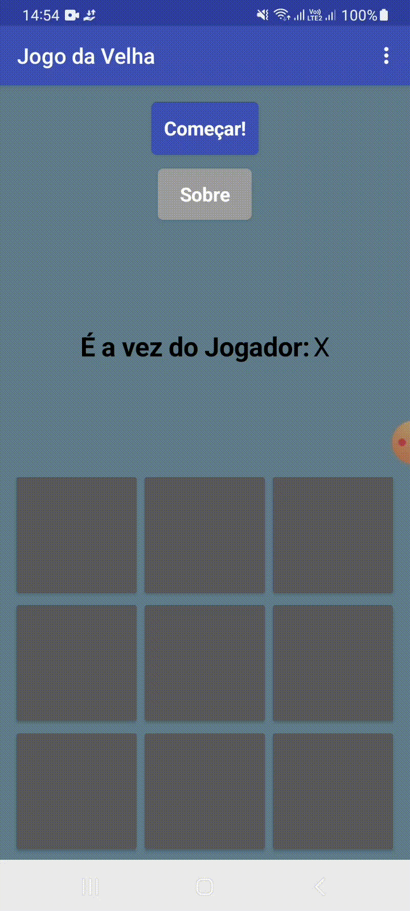
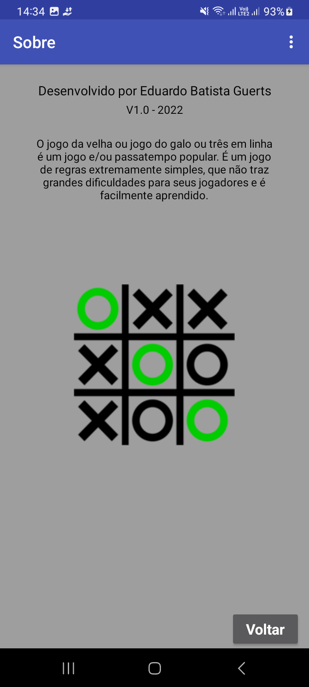
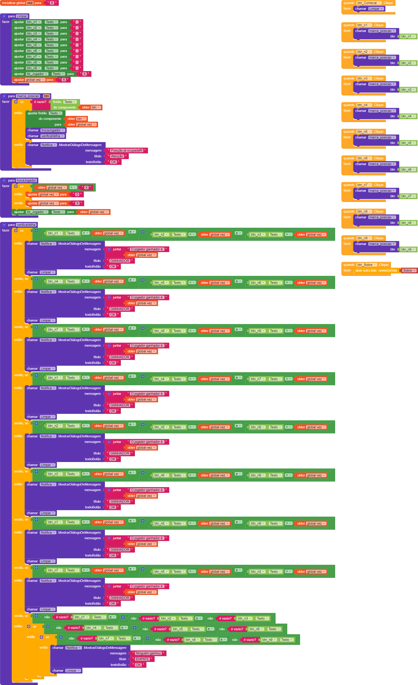

# Jogo da Velha
Jogo da velha para android desenvolvido por mim no modulo II do curso técnico em desenvolvimento de sistemas, utilizando a plataforma Kodular com programação em blocos.

## Imagens

  
  

## Programação em blocos

  

